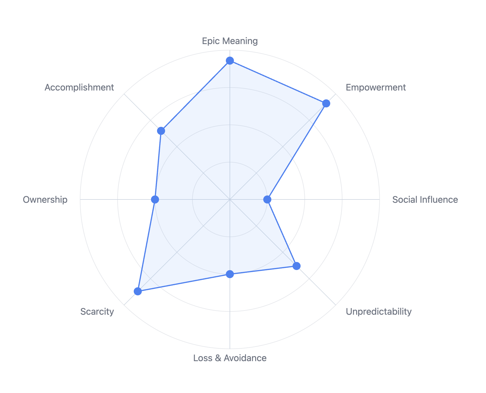

# Octalysis Tool (Angular, Offline)

A local, offline-first implementation of the Octalysis Tool as a single-page application built with Angular. It adapts the original Yu-kai Chou Octalysis method for quick, private motivation analysis while remaining simple to use and easy to share.

Live demo: https://octalysis-tool.com/

## Screenshot

Important: The Octalysis Framework is created by Yu-kai Chou. Learn more at https://yukaichou.com.

## Goals
- Provide a fast, privacy-friendly Octalysis analysis tool that works fully offline
- Keep UX modern, minimal, and accessible
- Support exporting results and simple collaboration via files/screenshots
- Offer both English and Russian language experiences (default: English)

## Features
- 8 Core Drives radar chart with interactive drag handles
- Project name field and per-drive notes/comments
- Live updates and smooth transitions
- Theme switch (light/dark)
- Export: PNG, SVG, PDF
- Localization: English (default) and Russian
- Offline: data persisted in Local Storage

## Non‑Functional
- Offline, no external APIs required
- Performs smoothly on modern browsers
- Basic accessibility (WCAG-oriented) and keyboard-friendly
- Cross-browser: Chrome, Firefox, Edge, Safari

## Tech Stack
- Angular (standalone components) + RxJS
- D3.js for the radar chart
- SCSS with CSS Variables for theming
- State via services + BehaviorSubject
- Local Storage for persistence

## Repository Layout
- `octalysis-tool/` — Angular app (source inside `octalysis-tool/src`)
- `assets/`, `docs/`, `tests/` — follow typical project conventions (see repo guidelines)

Key paths inside the app:
- `src/app/features/*` — chart, settings, project, comments, export service
- `src/app/core/*` — i18n, theme, state, storage, SEO service
- `src/assets/i18n` — translation dictionaries
- `src/robots.txt`, `src/sitemap.xml`, `src/404.html`, `src/CNAME` — static hosting/SEO helpers

## Getting Started (Local)
Prerequisites: Node.js 18+ and npm.

1) Install and run dev server
- `cd octalysis-tool`
- `npm ci`
- `npm run start`
- Open `http://localhost:4200`

2) Build production
- `npm run build`
- Output: `octalysis-tool/dist/octalysis-tool/`

## Contributing
Pull requests are welcome. Please keep changes focused, follow the existing style, and update docs/tests when applicable.

## Credits & Attribution
- Octalysis Framework: Yu-kai Chou — https://yukaichou.com

This project is not affiliated with Yu-kai Chou. “Octalysis” and related marks belong to their respective owners.
